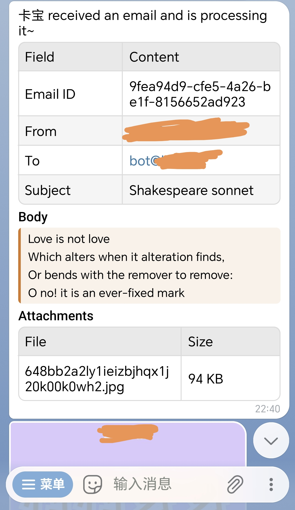
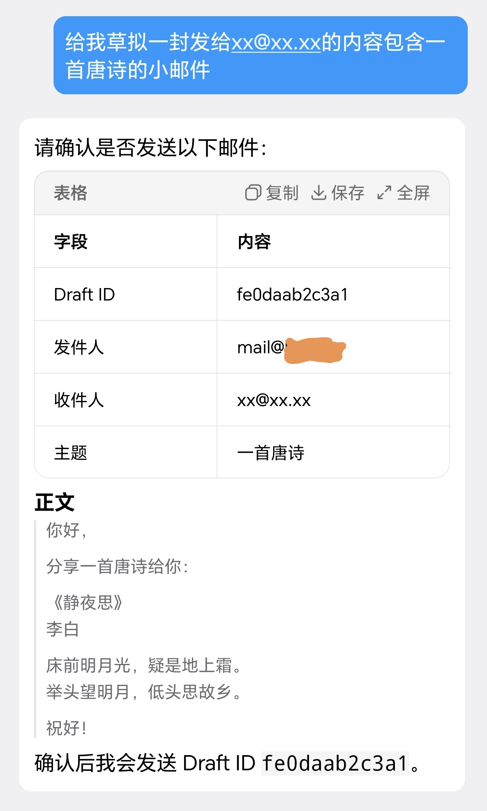

# Resend Hermes Bridge

中文 | [English](README.en.md)

Resend Hermes Bridge 是一个运行在本机的 FastAPI 桥接服务，用来把 Resend Inbound Email 接入本地 Hermes 运行时。

它做三件事：

1. 接收并校验 Resend 的 `email.received` Webhook。
2. 拉取完整入站邮件和附件，通知邮件主人，并在命中机器人邮箱时交给 Hermes 处理。
3. 统一负责对外发邮件，包括机器人自动回复和 Hermes MCP 手动发信。

Hermes 可以决定任务怎么做，但外部发送动作由桥接层落地。这样可以把 Webhook 验签、附件落盘、Resend 发信、草稿确认、审计日志和恢复逻辑集中在一个边界里。

## 效果预览

| Telegram | QQ |
|:--------:|:--:|
|  |  |

## 架构概览

```text
Resend Inbound
    |
    |  email.received + Svix signature
    v
FastAPI bridge 127.0.0.1:8765
    |
    |-- fetch inbound email and attachments from Resend
    |-- write state to data/state.db
    |-- notify owner through Hermes send
    |-- run Hermes chat for bot-addressed emails
    |-- send Resend replies when Hermes returns action=reply
    |
    v
Hermes local runtime
```

手动发信走另一条路径：

```text
Hermes MCP resend_email
    |
    |-- confirmed=false: create local draft and show preview
    |-- user confirms in chat
    |-- confirmed=true + draft_id: bridge validates draft and sends
    |-- list/search/view/delete/tag local email history
    v
Resend outbound email
```

## Resend 配置

先在 Resend 配好邮件侧资源：

1. 在 `resend.com` 添加并验证发信域名，例如 `example.com`。
2. 创建 API key，后续写入 `RESEND_API_KEY`。
3. 创建 Inbound Email Webhook，事件选择 `email.received`。
4. 复制 Webhook Signing Secret，后续写入 `RESEND_WEBHOOK_SECRET`。

## Nginx 转发

将你的 Resend Webhooks Endpoint 用 Nginx 转发到本地固定接口：

```text
https://your-domain.example/your-resend-endpoint
    -> http://127.0.0.1:8765/webhooks/resend
```

如果在 `.env` 里把 `RESEND_BRIDGE_PORT` 改成了其他端口，Nginx 示例里的 `8765`
也要同步替换。

不要把 `/send`、`/show-draft`、`/health` 整个服务直接暴露到公网。

## 快速安装

```sh
git clone https://github.com/AstraLeap/resend-hermes-bridge.git
cd resend-hermes-bridge
./scripts/install.sh
```

检查服务：

```sh
systemctl --user status resend-hermes-bridge.service
curl http://127.0.0.1:8765/health
```

如果使用了自定义端口，把上面的 `8765` 换成 `.env` 中的 `RESEND_BRIDGE_PORT`。

卸载：

```sh
./scripts/uninstall.sh
```

## 手动安装

如果不使用安装脚本，可以手动执行：

```sh
python3 -m venv .venv
. .venv/bin/activate
pip install -r requirements.txt
cp .env.example .env
$EDITOR .env
```

编辑 `.env` 后安装 systemd 用户服务和 MCP 配置：

```sh
mkdir -p ~/.config/systemd/user
cp scripts/resend-hermes-bridge.service ~/.config/systemd/user/resend-hermes-bridge.service
$EDITOR ~/.config/systemd/user/resend-hermes-bridge.service
systemctl --user daemon-reload
.venv/bin/python scripts/manage.py install-mcp
systemctl --user enable --now resend-hermes-bridge.service
```

模板里的 `/path/to/resend-hermes-bridge` 和用户路径必须改成实际路径。

## 运维命令

查看数据库健康状态：

```sh
.venv/bin/python scripts/manage.py status
```

查看失败事件：

```sh
.venv/bin/python scripts/manage.py failed --limit 20
```

查看某封邮件的处理步骤：

```sh
.venv/bin/python scripts/manage.py steps <email_id>
```

查看 MCP 草稿：

```sh
.venv/bin/python scripts/manage.py drafts
```

重新注册 MCP：

```sh
.venv/bin/python scripts/manage.py install-mcp
```

查看服务日志：

```sh
journalctl --user -u resend-hermes-bridge.service -f
```

## 友情社区

- [linux.do](https://linux.do/)

## 许可证

MIT
